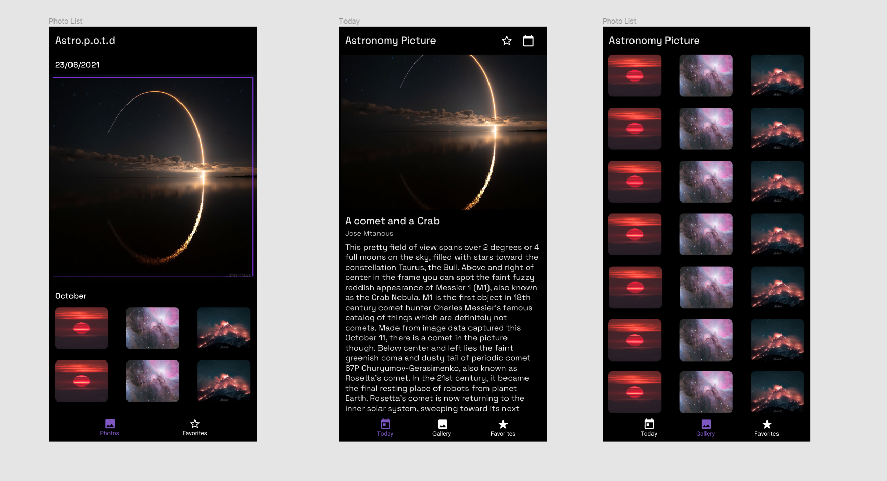
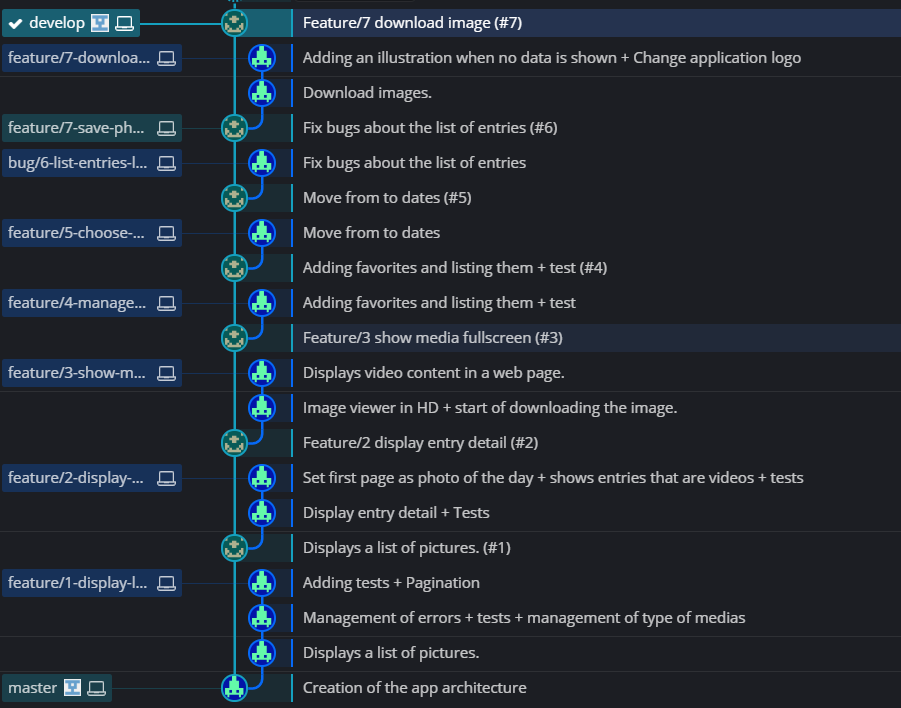
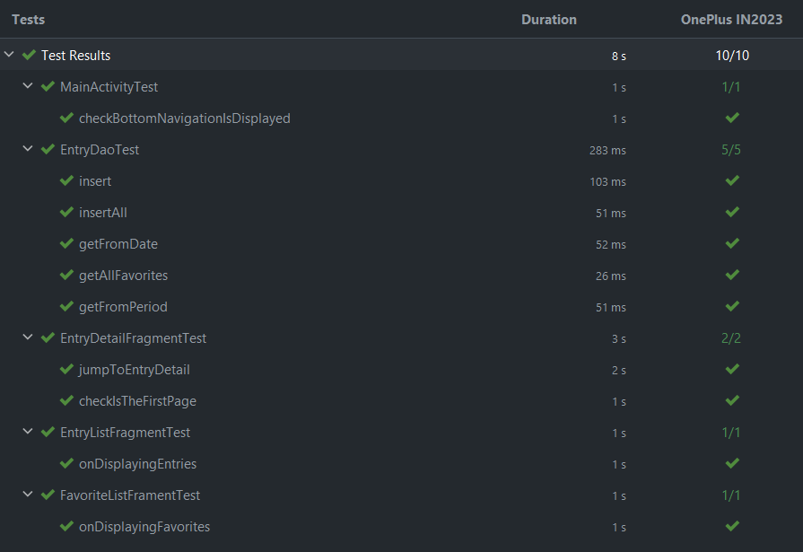
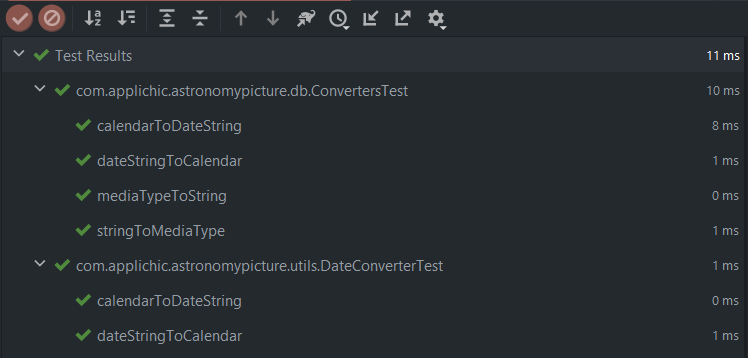

# Astronomy Picture

Astronomy Picture est une application android écrite pour répondre à un test technique.

Le but étant de proposer un outil qui affiche côté smartphone les photos/vidéos du jour de la NASA.

API: https://api.nasa.gov/

APK: 

# Démonstration

# Fonctionnalités

* Affiche le média du jour avec un détail sur la première page
* Visualiser la liste des médias (avec thumbnail pour les vidéos) du mois
* Possibilité de scroller la liste pour découvrir les médias des mois précédents
* Visualiser la photo en HD ou la vidéo dans une webview
* Télécharger la photo qui s'affichera dans la galerie
* Gestion du mode déconnecté avec une BDD Locale et la mise en cache des photos
* Ajout de média en favoris
* Afficher la liste des médias favoris trié par date de parution
* Ouvrir un calendrier pour chercher le média d'une journée précisé par l'utilisateur

# Technique

L'application est développée en Kotlin, MVVM, architecture composante.

https://developer.android.com/jetpack/guide

J'ai utilisé les librairies suivantes:

* Room
* Hilt
* Retrofit
* Navigation AndroidX
* Glide
* Piasy
* Espresso (Tests)

# Design

Une fois avoir reçu le sujet, ma première étape a été de créer des idées de design sur Figma.

J'ai choisis un thème sombre et une police qui rappelle l'espace pour que l'application suive le thème de la NASA.

# GIT

Le premier commit du repository a été la création globale de l'architecture de l'application.

J'ai suivi par la suite Gitflow pour la gestion des branches et des Pull requests sur Github pour les valider.

# Tests

Pour s'assurer un minimum de la qualité de l'application j'ai créé des tests automatiques JUnit et Espresso tout au long du développement.

